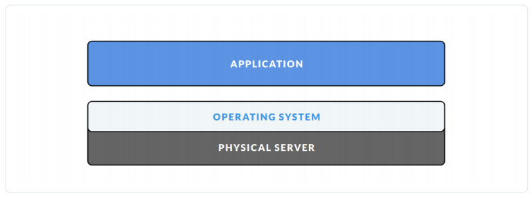
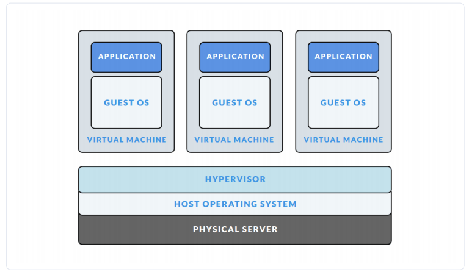
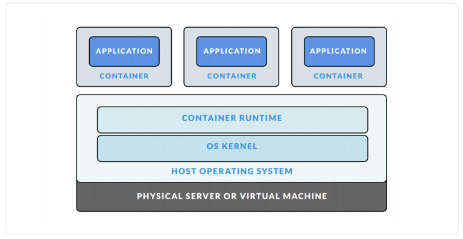

# Docker

1. [Containerlization](#container)
2. [Tổng quan về Docker](#overview)
3. [Một số các khái niệm](#define)
4. [Các thành phần cấu trúc](#arch)
5. [Network trong Docker](#network)
6. [Volume trong Docker](#volume)
7. [File Images](#imagefile)
8. [Dockerfile](#dockerfile)

## 1. Containerlization?

### 1.1 Lịch sử hình thành

Mô hình truyền thống của một server sẽ chỉ chạy được một OS:

điều này gây lãng phí tài nguyên.

Ngày nay, các ngành công nghiệp đều sử dụng máy ảo để chạy các ứng dụng phần mềm, các VM sẽ chạy các ứng dụng trong môi trường của OS khác ngay trên phần cứng ảo được hỗ trợ bởi hệ điều hành máy chủ. nên công nghệ `vitualization` ra đời, nhằm ảo hóa phần cứng và có thể tạo ra nhiều máy ảo với các OS khác nhau

Khi đó, mỗi máy ảo sẽ được cấp phát dung lượng RAM, nó sẽ chiếm toàn bộ chỗ dung lượng đó trên máy thật trong khi chạy (không cần biết có sử dụng hay không), và thời gian bật tắt cũng khá lâu, có thể mất vài phút để chuẩn bị (nếu ai đã dùng VMware hoặc Vituabox cũng đã biết)

Sau này công nghệ `Containerlization` đã ra đời, khắc phục được một số nhược điểm của các công nghệ trước đó

Với công nghệ này, có thể sinh ra nhiều máy ảo như `vitualization`, nhưng tận dụng được tối ưu tài nguyên của máy (dùng bao nhiêu cấp bấy nhiêu, không dùng thì thu hồi)

Điểm nổi bật nhất của `Containerlization` là sử dụng các `container`

### 1.2 Khái niệm

`Container` cung cấp cơ chế đóng gói các ứng dụng trong môi trường mà chúng thực sự chạy, cô lập với môi trường bên ngoài. Sự cô lập này cho phép các ứng dụng dựa trên container sẽ được triển khai một cách dễ dàng, nhất quán, bất kể môi trường đích là môi trường nào: private data center hay the public cloud thậm chí có thể là máy tính cá nhân của các developer.

`Container` tạo ra một môi trường chứa mọi điều kiện cần để ứng dụng có thể chạy trên đó mà không bị các yếu tố liên quan đến môi trường của hệ thống làm ảnh hưởng, và ngược lại, cũng không bị xung đột với các ứng dụng khác của hệ thống.

Các tiến trình trong container bị cô lập với các tiến trình của các container khác trong cùng một hệ thống nhưng dùng chung tài nguyê của hệ thống.

Ưu điểm:

* Linh động: Triển khai ở bất kỳ nơi đâu do sự phụ thuộc của ứng dụng vào tầng OS cũng như cơ sở hạ tầng được loại bỏ.
* `Nhanh`: Do chia sẻ host OS nên container có thể được tạo gần như một cách tức thì. Điều này khác với vagrant - tạo môi trường ảo ở level phần cứng, nên khi khởi động mất nhiều thời gian hơn.
* `Nhẹ`: Container cũng sử dụng chung các images nên cũng không tốn nhiều disks.
* `Đồng nhất` :Khi nhiều người cùng phát triển trong cùng một dự án sẽ không bị sự sai khác về mặt môi trường.
* `Đóng gói`: Có thể ẩn môi trường bao gồm cả app vào trong một gói được gọi là container. Có thể test được các container. Việc bỏ hay tạo lại container rất dễ dàng.

Do có ưu điểm lớn như vậy, nên container (Docker) được sử dụng rất nhiều và rộng rãi bởi các công ty lớn như Google, Facebook, Netflix,... 

Nhưng nó cũng có một số nhược điểm về tính an toàn, do dùng chung OS nên nếu có bất kỳ lỗ hổng nào đó ở kernel thì nó sẽ ảnh hưởng tới tất cả các container có trong host đó. Và còn một vẫn đề nữa, nếu một ứng dụng nào đó trong container có được quyền superuser thì sẽ khác nguy hiểm.

## 2. Tổng quan về docker
### 2.1 Docker là gì?

Trước đây, các tổ chức lớn sử dụng công nghệ containerlization đều private source của họ, cho tới khi có một công ty public source code của họ và tung ra sản phẩm mang tên Docker gây được rất nhiều sự chú ý, sau đó công ty này cũng đổi tên thành Docker. Vậy Docker là gì?

Docker là một ứng dụng mã nguồn mở cho phép độc lập triển khai giữa các ứng dụng và cơ sở hạ tầng đối với các nhà phát triển và mở ra tiềm năng tạo nên một mô hình cho sự hợp tác tốt và đổi mới hơn.

Ban đầu được viết bằng python nhưng sau này đã chuyển sang viết bằng golang.

Docker hiện nay được hỗ trợ trên cả 3 hệ điều hành phổ biến: Windows, Linux, Mac OS

**Docker trên windows:** Do windows có mã nguồn đóng mà docker lại là mã nguồn mở, nên khi cài docker trên Windows (hay MacOS) thì Docker sẽ cài một máy ảo `Linux` trên máy thật và Docker sẽ hoạt động dựa trên máy ảo đó.

Xem thêm về Window docker [tại đây](https://viblo.asia/p/docker-chua-biet-gi-den-biet-dung-phan-1-ByEZkWrEZQ0)

Docker có 2 phiên bản, CE( dành cho nhà phát triển, nhóm nhỏ, coder như chúng ta) và EE (dành cho doanh nghiệp).

### 2.2 Chức năng, vai trò của Docker

Docker giải quyết vấn đề khi mà các doanh nghiệp ngày nay đang chịu áp lực phải chuyển đổi kỹ thuật số nhưng bị hạn chế bởi các ứng dụng và cơ sở hạ tầng hiện tại đồng thời hợp lý hóa danh mục cloud, trung tâm dữ liệu và kiến trúc ứng dụng ngày càng đa dạng.

## 3. Một số các khái niệm

Các khái niệm: Docker images, docker registry, docker volume, docker container, Dockerfile

### 3.1 Docker Images
* Image trong Docker hay còn gọi là Mirror. Là một template có sẵn (hoặc có thể tự tạo) với các chỉ dẫn dùng để tạo ra các container.
* Được xây dựng từ một loạt các layers. Mỗi layer là một kết quả đại diện cho một lệnh trong Dockerfile.
* Lưu trữ dưới dạng “read-only template”. Chẳng hạn, một image chứa hệ điều hành Ubuntu đã cài đặt sẵn Apache và ứng dụng web.

### 3.2 Docker Registry

* Docker Registry là nơi lưu trữ các image với hai chế độ là private và public.

* Là nơi cho phép chia sẻ các image template để sử dụng trong quá trình làm việc với Docker

### 3.3 Docker volume

* Volume trong Docker là nơi dùng để chia sẻ dữ liệu cho các container.

* Có thể thực hiện sử dụng Volume đối với 2 trường hợp:
	* Chia sẻ giữa container với container.
	* Chia sẻ giữa container và host.

### 3.4 Docker container

Công nghệ `Docker container` được ra mắt vào năm 2013 dưới dạng nguồn mở `Docker Engine`, nó là một thể hiện của Docker Image với những thao tác cơ bản để sử dụng qua CLI như start, stop, delete,...

Container Image là một gói phần mềm thực thi lightweight, độc lập và có thể thực thi được bao gồm mọi thứ cần thiết để chạy được nó: code, runtime, system tools, system libraries, settings. Các ứng dụng có sẵn cho cả Linux và Windows, các container sẽ luôn chạy ổn định bất kể môi trường.

Containers and virtual machines có sự cách ly và phân bổ tài nguyên tương tự, nhưng có chức năng khác vì các container ảo hóa hệ điều hành thay vì phần cứng. Các container có tính portable và hiệu quả hơn.

### 3.5 Dockerfile

* Docker Image có thể được tạo ra một cách tự động bằng việc đọc các chỉ dẫn trong Dockerfile.

* Dockerfile là một dữ liệu văn bản bao gồm các câu lệnh mà người sử dụng có thể gọi qua các dòng lệnh để tạo ra một image.

* Bằng việc sử dụng docker build người dùng có thể tạo một tự động xây dựng thực hiện một số lệnh dòng lệnh liên tiếp.

## 4. Các thành phần, cấu trúc trong Docker

Các thành phần của Docker Engine

Docker Engine là một ứng dụng client-server với các thành phần chính:

* Một máy chủ đảm nhiệm thực hiện quá trình daemon (chạy câu lệnh dockerd).
* REST API xác định các giao diện mà các chương trình có thể sử dụng để nói chuyện với daemon và hướng dẫn nó phải làm gì.
* Một CLI (chạy câu lệnh docker).

## 5. Network trong Docker

Dưới đây là hình ảnh mô tả kiến trúc Network của Container hay còn gọi là Container Networking Model (CNM).

Đây là cấu trúc mức độ cao trong CNM. Theo đó, ta có:

* Sandbox - Chứa các cấu hình của ngăn xếp mạng container. Bao gồm quản lý network interface, route table và các thiết lập DNS. Một Sandbox có thể được coi là một namespace network và có thể chứa nhiều endpoint từ nhiều mạng.
* Endpoint - Là điểm kết nối một Sandbox tới một mạng.
* Network - CNM không chỉ định một mạng tuân theo mô hình OSI. Việc triển khai mạng có thể là VLAN, Bridge,... Các endpoint không kết nối với mạng thì không có kết nối trên mạng.
* CNM cung cấp 2 interface có thể được sử dụng cho việc liên lạc, điều khiển,... container trong mạng:

	* Network Drivers - Cung cấp, thực hiện thực tế việc tạo ra một mạng hoạt động. Được sử dụng với các drivers khác và thay đổi một cách dễ dàng đối với các trường hợp cụ thể. Nhiều network driver có thể được sử dụng trong Docker nhưng mỗi một network chỉ là một khởi tạo từ một network driver duy nhất. Theo đó mà ta có 2 loại chính của CNM network drivers như sau:

		* Native Network Drivers - Là một phần của Docker Engine và được cung cấp bới Docker. Có nhiều drivers để dễ dàng lựa chọn cho khả năng của mạng như overlay networks hay local bridges.
 
		* Remote Network Drivers - Là các network drivers được tạo ra bởi cộng đồng và các nhà cung cấp. Được sử dụng để tích hợp vào các phần mềm hoặc phần cứng đang hoạt động.

	* IPAM Drivers: Drivers quản lý các địa chỉ IP cung cấp mặc định cho các mạng con hoặc địa chỉ IP cho các mạng và endpoint nếu chúng không được chỉ định. Địa chỉ IP cũng có thể gán thủ công qua mạng, container,...

## 6. Volume trong Docker

[Docker Volume](docker_volume.md)

## 7. File Images

## 8.Dockerfile

# Tham khảo

Tôi học và tìm hiểu theo tài liệu ở đây: https://github.com/hocchudong/ghichep-docker

Tham khảo thêm:

https://docker-curriculum.com/

https://viblo.asia/p/docker-chua-biet-gi-den-biet-dung-phan-1-ByEZkWrEZQ0