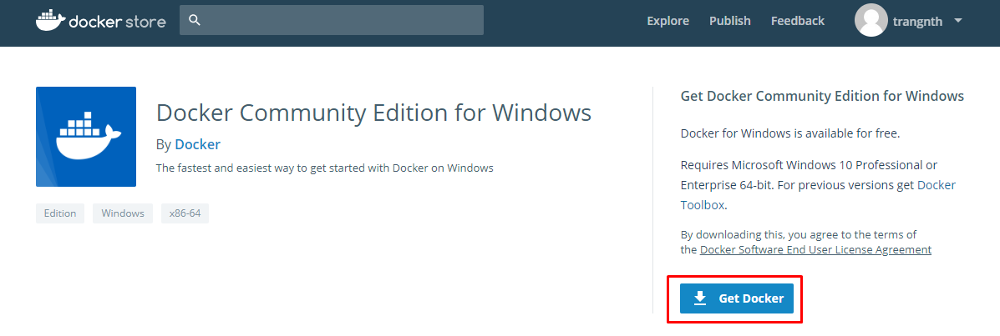
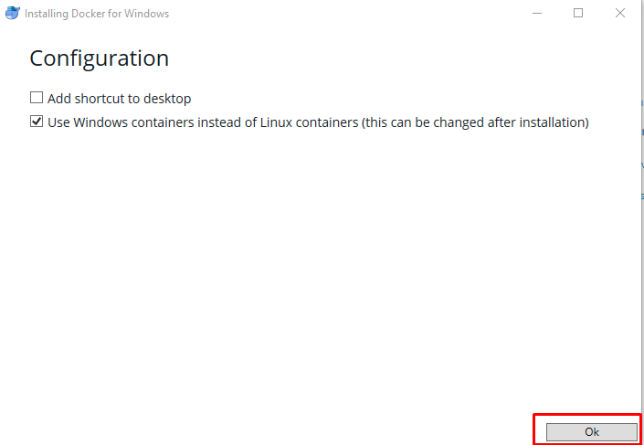
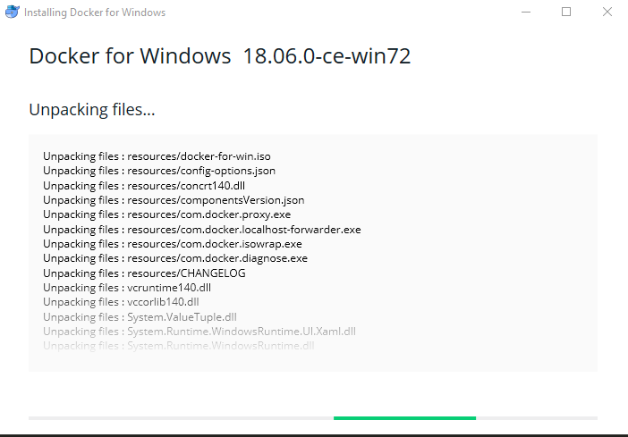
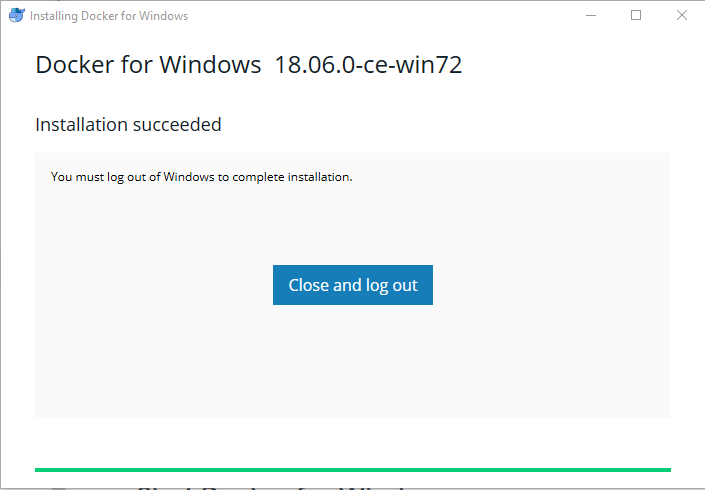
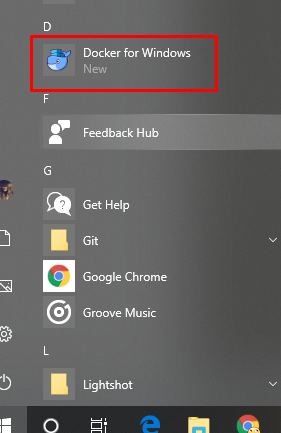
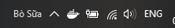

# Bắt đầu với docker

1. [Install Docker CE for Ubuntu](#ubuntu)
2. [Install Docker for Windows](#windows)
3. [Một số thao tác cơ bản khi sử dụng docker](#command)

<a name="ubuntu"></a>
## 1. Install Docker CE for Ubuntu 

### OS requirements

Để cài đặt Docker CE yêu cầu version 64-bit một trong số các version sau của Ubuntu:
* Bionic 18.04 (LTS)
* Artful 17.10
* Xenial 16.04 (LTS)
* Trusty 14.04 (LTS)

### Uninstall old versions 

Nếu trước đã đã cài một bản cũ của docker thì hãy gõ nó đi trước khi cài đặt mới:

	$ sudo apt-get remove docker docker-engine docker.io

### Install Docker CE for ubuntu 16.04

Update the apt package index

	$ sudo apt-get update

Install packages to allow apt to use a repository over HTTPS

```sh
$ sudo apt-get install \
    apt-transport-https \
    ca-certificates \
    curl \
    software-properties-common
```

Add Docker’s official GPG key:

	$ curl -fsSL https://download.docker.com/linux/ubuntu/gpg | sudo apt-key add -

Verify that you now have the key with the fingerprint 9DC8 5822 9FC7 DD38 854A E2D8 8D81 803C 0EBF CD88, by searching for the last 8 characters of the fingerprint.

```
$ sudo apt-key fingerprint 0EBFCD88

pub   4096R/0EBFCD88 2017-02-22
      Key fingerprint = 9DC8 5822 9FC7 DD38 854A  E2D8 8D81 803C 0EBF CD88
uid                  Docker Release (CE deb) <docker@docker.com>
sub   4096R/F273FCD8 2017-02-22
```

Use the following command to set up the stable repository:

```sh
$ sudo add-apt-repository \
   "deb [arch=amd64] https://download.docker.com/linux/ubuntu \
   $(lsb_release -cs) \
   stable"
```

Install the latest version of Docker CE, or go to the next step to install a specific version:

	$ sudo apt-get install docker-ce

Verify that Docker CE is installed correctly by running the hello-world image.

	$ sudo apt-get update
	$ sudo docker run hello-world

Check xem đã chạy được docker chưa:

	systemctl status docker


### Uninstall Docker CE

Gỡ bỏ gói cài đặt Docker CE:
	
	$ sudo apt-get purge docker-ce

Images, containers, volumes, or customized configuration files trên máy sẽ không tự động bị xóa đi, để xóa tất cả các images, container, columes đi ta làm như sau:

	$ sudo rm -rf /var/lib/docker

Còn sự thay đổi trong file config thì phải tự xóa bằng tay


<a name="windows"></a>
## 2. Install Docker for Windows 

Đi đến [Docker Store](https://store.docker.com/editions/community/docker-ce-desktop-windows) để download Docker for Windows 



### Install Docker for Windows desktop app

Double-click `Docker for Windows Installer.exe` để bắt đầu cài đặt



Tiến hành các bước cài đặt để accept the license



Click `Close and log out` để hoàn thành setup




Start Docker for Windows 



Đợi một lúc để nó start




<a name="command"></a>
## 3. Một số thao tác cơ bản khi sử dụng docker

### Tạo một container

Cú pháp:

	docker run <image_name> <command>

Ví dụ tạo một container từ image hello-world:

	docker run hello-world

#### Chạy một container và in ra màn hình dòng chữ "hello world"

	docker run ubuntu echo 'hello world'

Khi đó một container sẽ được khởi chạy và lệnh `echo 'hello world'` sẽ được thực hiện trong container, sau đó in ra màn hình kết quả chạy.

#### Chạy với tùy chọn `-it`

Để có thể thao tác trực tiếp trong container (truy cập vào container) ta sử dụng tùy chọn `-it`

	$ root@trang-20-51:~# docker run -it ubuntu
	$ root@d864eb3f3174:/# 

Ở đây ta đã sử dụng tùy chọn `-it`, trong đó `-i` là tùy chọn sử dụng để tạo container với chế độ tương tác, tùy chọn `-t` là tùy chọn mở ra một phiên làm việc. Nếu chỉ sử dụng tùy chọn `-i` thì chúng ta sẽ mở ra một section và đóng lại luôn. Nếu sử dụng chỉ tùy chọn `-t` thì sẽ mở ra một section và không thao tác được.

#### Tạo một container với chế độ deamon, sử dụng tùy chọn `-d`

Thông thường, khi tạo một container với các tùy chọn trước thì sau khi tạo xong hoặc thoát container thì ngay lập tức container đó sẽ dừng hoạt động. Trong một số trường hợp ta sẽ cần các container chạy ngầm, trong trường hợp này ta sử dụng tùy chọn -d

	docker run -d httpd

Sau khi chạy xong sử dụng `docker ps` để kiểm tra các container đang chạy. Nếu không có tùy chọn `-d` thì sẽ không có container `httpd`, nếu thêm `-d` vào thì container sẽ được bật ngay sau khi chạy xong lệnh trên.

#### Tạo một container với port chỉ định, sử dụng tùy chọn `-p`

Ví dụ tôi muốn tạo một container chạy web và ánh xạ port 4000 của máy host tới port 80 của container được tạo ra:

	docker run -d -p 4000:80 httpd

Nếu không chỉ định port thì container sẽ sinh ra một port mặc định của nó.

Sử dụng lệnh `curl` để kiểm tra kết quả:

	$ curl localhost:4000
	<html><body><h1>It works!</h1></body></html>

Có thể sử dụng option `-p` cho nhiều port cùng lúc:

	-p 4000:80 8081:3306

Nếu muốn sử dụng port ngẫu nhiên cho toàn bộ các port có sẵn trong container, ta sử dụng tùy chọn `-P`

	docker run -d -P nginx

#### Thao tác với một container đã tồn tại

Khi một container đang ở trạng thái `UP` thì ta có thể truy cập vào để thao tác với dòng lệnh như dưới đây:

	docker exec -it <ID_container> /bin/bash

### Chỉ định RAM, CPU cho một container 

Ví dụ:

	docker run -d -p 4000:80 --name webserver --memory 400m --cpus 0.5 httpd

Trong đó:

* `--memory`: là giá trị RAM cấp cho container
* `--cpus`: là giá trị CPU gán cho container
* `--name`: tên của container

### Xem nội dung của một container, xem log và kiểm tra port

Kiểm tra một số thông tin cơ bản của container:

	docker inspect <ID_container or NAME_container>

Để xem log của một container:

	docker logs -f <ID_container or NAME_container>

Kiểm tra port của một container:

	docker port <ID_container or NAME_container>

### Xóa một container

Để xóa một container (nếu nó đang chạy) thì cần tắt nó đi trước:

	docker stop <ID_container or NAME_container>

Sau đó có thể sử dụng một trong hai lệnh sau để xóa container:

	docker rm <ID_container or NAME_container>
	docker rm -f <ID_container or NAME_container>

Để xóa toàn bộ các container:

	docker rm -f `docker ps -ap`


## Tham khảo
https://www.digitalocean.com/community/tutorials/how-to-install-and-use-docker-on-ubuntu-16-04

https://docs.docker.com/install/linux/docker-ce/ubuntu/#install-docker-ce-1